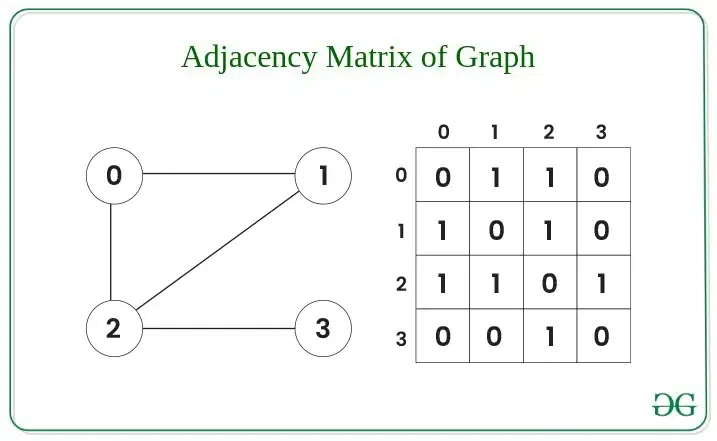
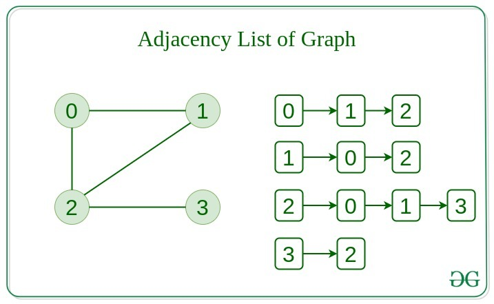

# Graphs
Graph is a non-linear data structure consisting of vertices and edges. The vertices are sometimes also referred to as nodes and the edges are lines or arcs that connect any two nodes in the graph. More formally a Graph is composed of a set of vertices( V ) and a set of edges( E ). The graph is denoted by G(V, E).

**Components of Graph Data Structure**
1. Vertices: Vertices are the fundamental units of the graph. Sometimes, vertices are also known as vertex or nodes. Every node/vertex can be labeled or unlabelled.

2. Edges: Edges are drawn or used to connect two nodes of the graph. It can be ordered pair of nodes in a directed graph. Edges can connect any two nodes in any possible way. There are no rules. Sometimes, edges are also known as arcs. Every edge can be labelled/unlabelled.

**Representation of Graph Data Structure**
There are multiple ways to store a graph, following are the most common representations:
1. Adjacency Matrix Representation
2. Adjacency List Representation

*Adjacency Matrix Representation of Graph Data Structure*
In this method, the graph is stored in the form of the 2D matrix where rows and columns denote vertices. Each entry in the matrix represents the weight of the edge between those vertices. 

*Adjacency List Representation of Graph*
This graph is represented as a collection of linked lists. There is an array of pointer which points to the edges connected to that vertex. 
