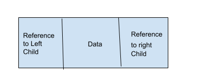
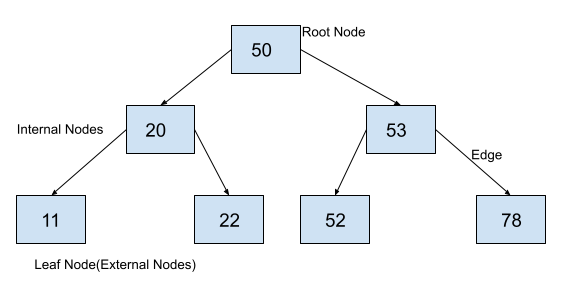

# Binary search tree
A binary tree is a tree data structure in which each node can have a maximum of 2 children.  It means that each node in a binary tree can have either one, or two or no children. Each node in a binary tree contains data and references to its children. Both the children are named as left child and the right child according to their position. The structure of a node in a binary tree is shown in the following figure.

**Properties of Binary Search Tree.**
- There are no duplicate elements in a binary search tree.
- The element at the left child of a node is always less than the element at the current node.  
- The left subtree of a node has all elements less than the current node.
- The element at the right child of a node is always greater than the element at the current node.
- The right subtree of a node has all elements greater than the current node. 

**How to Insert an Element in a Binary Search Tree?**
1. The current node can be an empty node i.e. None. In this case, we will create a new node with the element to be inserted and will assign the new node to the current node.

2. The element to be inserted can be greater than the element at the current node. In this case, we will insert the new element in the right subtree of the current node as the right subtree of any node contains all the elements greater than the current node.

3. The element to be inserted can be less than the element at the current node. In this case, we will insert the new element in the left subtree of the current node as the left subtree of any node contains all the elements lesser than the current node.

To insert an element, we will start from the root node and will insert the element into the binary search tree according to the above defined rules. 

**How to search an element in a Binary search Tree?**
Binary search tree cannot have duplicate elements, we can search any element in a binary search tree using the following rules that are based on the properties of the binary search trees. 

1. If the current node is empty, we will say that the element is not present in the binary search tree.

2. If the element in the current node is greater than the element to be searched, we will search the element in its left subtree as the left subtree of any node contains all the elements lesser than the current node.

3. If the element in the current node is less than the element to be searched, we will search the element in its right subtree as the right subtree of any node contains all the elements greater  than the current node.

4. If the element at the current node is equal to the element to be searched, we will return True.

**Binary Search Tree**
                  Average	   Worst case
Space	           O(n)	        O(n)
Access	           O(log n)	    O(n)
Search	           O(log n)	    O(n)
Insertion	       O(log n)	    O(n)
Removal	           O(log n)	    O(n)
